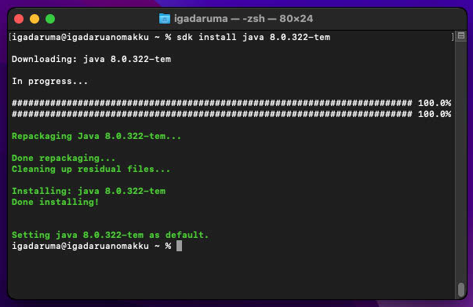
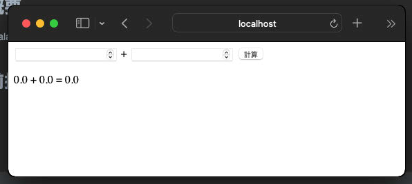
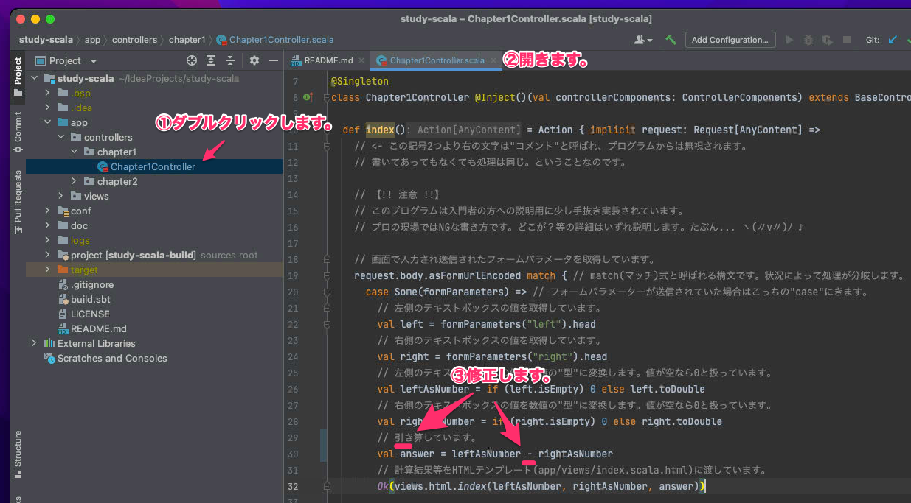
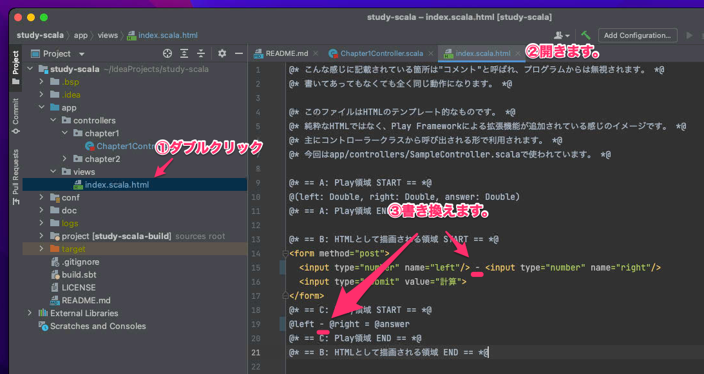

# Chapter1. プログラミング👩‍💻体験(Mac版) 

Chapter1では、プログラミングのなんちゃって体験をするの巻です。  
何をやっているかわからないことだらけの内容にはなってしまうと思いますが、  
とりあえず手順をなぞってみて欲しいです。  
実際に体験するのとしないとでは天地の差があるまじろ(?)   
・・・では。いこうぞ😏

## 1. プログラムを書く準備(環境構築)

### 1-1. HomeBrew🍺のインストール

`⌘`キーを押しながら`Space`キーを押してSpotlightを起動します。  
今後はこの入力を`⌘ + Space`みたいに書きますね。


`ter`といった感じで入力するとターミナルアプリが出てくるので`Return`キーで起動します。


ここからはとにかくターミナルにコマンドを入力しまくっていきます。
記念すべき最初は、以下のコマンドを実行します。

```
/bin/bash -c "$(curl -fsSL https://raw.githubusercontent.com/Homebrew/install/HEAD/install.sh)"
```

コピーして(上記エリア内にカーソルを合わせると右端に出てくるアイコンをクリックすると簡単です)、  
ターミナル上をクリックして貼り付けます(`⌘ + V`)。  
以下のような感じになれば、`Return`キーで確定します。


パスワードを聞かれますので、  
macのロックを解除するとき等に入力して`Return`です。  
※パスワードを入力しても文字が出てこないのですが気にせず入力してください。


さらに`Return`押してね。と出るので押します。


ここからはとにかく待ちます。環境次第ではあるのですが、  
1時間近くかかっても不思議ではないので、座禅でもしてまちましょう(?)  
しかしながら、途中`Return`キーを押せと言われるので、その時は押します。

最終的に以下のような表示になれば完了です。


### 1-2. SDKMAN, JDK, sbt, IntelliJのインストール

引き続きターミナルで色々インストールしていきます。  
まずは`SDKMAN`というのを入れるために以下のコマンドを実行します。

```
curl -s "https://get.sdkman.io" | bash
```


これはすぐに完了すると思います。その後以下を実行します。

```
source "$HOME/.sdkman/bin/sdkman-init.sh"
```

このコマンドは特に何も表示されないので、  
最終的に以下のような感じになります。


お次は`JDK`を入れます。以下のコマンドを実行します。

```
sdk install java 8.0.322-tem
```


以下のような表示になれば完了です。



しかしながら、タイミングによっては以下のようにエラーになってしまうかもしれません。


これはインストールしようとしているバージョンが、  
古くなっていて消えている場合などにこうなります。  
その場合はまず以下のコマンドを実行してみてください。

```
sdk ls java | grep 8.0 | grep tem
```

下図のような結果が表示されます。


このうち一番右に表示されている文字の内、  
番号(バージョン)が一番おおきいものを見つけます。  
前述の元のインストールコマンドを少し変更して、  
以下のような形にして実行すればインストールできると思います。

```
sdk install java "見つけたバージョン"-tem
```

では次に`sbt`というのを入れます。

```
sdk install sbt
```


上図と比べて表示されている番号(バージョン)などに差異があっても構いません。

ではインストール編の最後に`IntelliJ`です。

```
brew install --cask intellij-idea-ce
```

こちらも10分以上かかるかもしれません。以下のようになれば完了です。


ここで、インストールしたものたちの解説をしておきます。

* HomeBrew: 色々インストールできるやつ。
* SDKMAN: 色々インストールできるやつ。
* JDK: Scalaのエンジン
* sbt: Scalaの親友
* IntelliJ: プログラマの心の友

・・・冗談です。  
ただ、使いながら解説したほうが良いと思ってますので、    
今後のチャプター等で逐次説明を交えていきます。

### 1-3. IntelliJを起動してScalaプラグインを追加

※以降の手順・画像はIntelliJのバージョンによって多少異なる場合があります。

お疲れさまでした。ここまででターミナルとはさようならになります。  
次はインストールしたIntelliJを使っていきます。  
`⌘ + Space`でSpotlightを起動して、  
`in`を入力するとIntelliJが出てくると思うので起動します。


macのバージョンにもよりますが、以下のようなのが出たら`開く`を押します。


利用規約が表示されるので、チェックを入れて進みます。


匿名データとしてあなたの使用情報を集めてよい？みたいな事を聞かれるので、  
これはどちらでもいいですが、悩めば`Dont't Send`を選択しておけばいいと思います。


次にScalaのプラグイン(追加機能みたいな感じ)を下図のように追加します。  
※下図"③"は必要に応じて入力ください。


IntelliJの再起動が必要なので、以下のように操作します。


## 2. サンプルプログラムの起動

### 2-1. IntelliJからGit経由で取得

サンプルScalaプログラムをダウンロードしていきます。  
`Get from VCS`を選択します。


(※場合によっては以下にあるかもしれません。)


(※macメニューバーが表示されている状況ならば以下にあります。)


開いたウィンドウの`URL`に以下のURLを入力します。  
※これはダウンロードするプログラム(ソース)がおいてある場所です。

```
https://github.com/igadaruma/study-scala
```

その下の`Directory`はダウンロードしたプログラム(ソース)を保存する先です。  
お好きな場所を指定ください。悩むようなら元々入っている値のままでOKです。


もし以下が表示されたら`Trust Project`を選択します。


もし以下のようなTipsモーダルが表示されたら`Close`を選択します。


初めて開く時はIntelliJが色々セットアップしてくれるので、  
落ち着くのを待ちます。状況次第ですが数分〜数十分かかる場合があります。

※下図で表示されている"Scalaっと"から始まる文章は書きかけ内容になっているので、  
実際は別の内容が表示されていると思います。


以下が落ち着いた状態です。


### 2-2. IntelliJのsbt shellからプログラムを起動

ウィンドウの下の方にある`sbt shell`をクリックすると、  
ウィンドウ下部の表示が切り変わり、文字がわらわらと出ます。  
以下のような表示になれば文字入力ができるので、  
`run`と入力して`Return`キーを押します。


さらにまた暫く待ち、以下のような始まった感のあるメッセージが出れば起動完了です。


そのままIntelliJは放置し、以下のリンクをクリックします。  
起動したプログラムにアクセスすることができます。  
👉 [http://localhost:9000](http://localhost:9000)  
初回アクセス時はちょっと(3分以内だとは思います)時間がかかるので焦らず待ちます。  
(ちなみに`localhost`というのは`自分のパソコン`みたいな意味です。)



では使ってみましょう。  
両方のテキストボックスに以下のように好きな数字を入れて`計算`をクリックします。


入力された数字が計算されていることが確認できれば成功です！


## 3. はじめてのプログラミング

ついにプログラマーになる瞬間がやってきました!  
プログラムを書き換えるというのを体験していきます。

### 3-1. 引き算に変えてみる

足し算プログラムだったのを引き算プログラムに変えてみましょう。  
IntelliJの画面に戻って作業していきます。

`app/controllers/chapter1/Chapter1Controller.scala`の30行目付近の以下を修正します(後に画像があります)。

```
// 足し算しています。
val answer = leftAsNumber + rightAsNumber
```

ここに以下の修正を行います。

* `足し` → `引き`
* `+` → `-`

結果的にはこんな感じに変わります。

```
// 引き算しています。
val answer = leftAsNumber - rightAsNumber
```

手順を画像で見るとこんな感じ。



次に`my-first-play/app/views/index.scala.html`の15行目を修正します(後に画像があります)。

```
<input type="number" name="left"/> + <input type="number" name="right"/>
```

* `+` → `-`

```
<input type="number" name="left"/> - <input type="number" name="right"/>
```

同様に19行目を修正します。

```
@left + @right = @answer
```

* `+` → `-`

```
@left - @right = @answer
```

画像で見るとこんな感じ。



### 3-2. 動作確認

今一度以下にアクセスしてみましょう。  
👉 [http://localhost:9000](http://localhost:9000)

画面が微妙に変わっていると思うので、  
先程と同様に操作するとこんな感じ。引き算になりました。


## まとめ

プログラミング完全に理解した！  
プログラミング完全に理解した！

完全に理解したけど物足りないという方は[Chapter2](../chapter2/chapter2.md)に進行を。

## 参考文献

### 利用したソフトウェアの公式ページ集

* [HomeBrew公式](https://brew.sh/index_ja)
* [SDKMAN公式(英語)](https://sdkman.io/)
* [JDK(Adoptium)公式(英語)](https://adoptium.net/)
* [sbt公式(英語)](https://www.scala-sbt.org/)
* [JetBrains公式(IntelliJ開発元)](https://www.jetbrains.com/ja-jp/)
