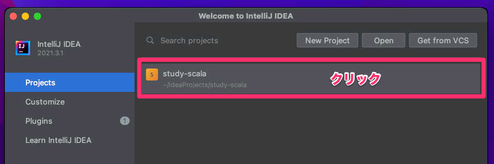
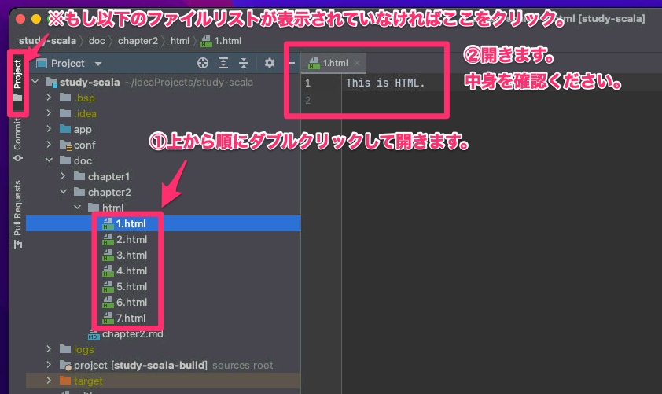
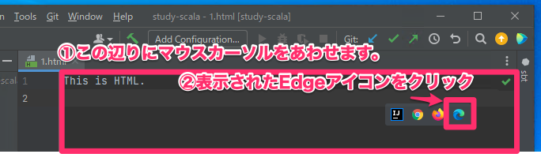
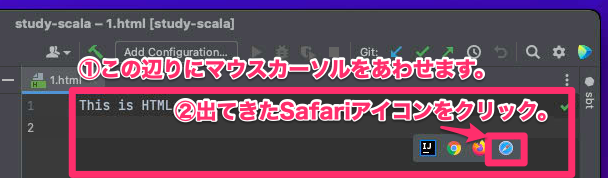
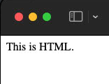

# Chapter2. Webアプリ is 何？

あら。来てしまいましたか・・。あなたも好きね(？)

Chapter2では、Chapter1で体験したプログラムを、  
あなた自身で初めから書けるようなるための第一歩として、  
`Web(ウェブ)アプリ`について少しお話させていただきます。  

今後ずっと、未知の話ばかりになると思いますが、  
少しずつ少しずつ知識を増やしてもらえたら幸いです・・！  
うーーーーん、ではいこう！

## 1. Webアプリってなーに。

### 1-1. 今から作っていきたいもの。

Chapter1で動かしたアプリは、ずばりWebアプリです。  
プログラミングで作るものは全てがWebアプリということでは決してないのですが、  
昨今はWebアプリを作る機会に溢れかえっているので、  
ここでもWebアプリを基にした話をさせていただいています。  
(※とはいえ他のアプリを書くための基礎技術も一緒に身につくのでご安心を。)

`ブラウザ`で操作するものは基本的にWebアプリの一種となりますが、  
まずはこのブラウザの説明を試みます。

## 1-2. ブラウザ

`ブラウザ`もプログラミングで作られるプログラム(アプリ)の種類の１つです。  
とはいえ一般のプログラマが自分で作る機会はほぼ無く、  
基本的には既製品を利用することになります。  
有名な既製品としては以下等があります。

* Chrome(クローム): Google社製
* Edge(エッジ): Microsoft社製(Windowsに標準装備)
* Firefox(ファイアフォックス): Mozilla社製
* Safari(サファリ): Apple社製(Macに標準装備)

この名前でもうピーンと来られた方もいるかもしれません。  
パソコンで今まさにこの文章を読むためや、  
Youtube等を見たりネットサーフィンをする時に使っているアプリがブラウザです。  
ブラウザを強引に表現すると、世界中に存在するWebアプリを、  
インターネットを介してダウンロードして実行するためのものです。  

一方で、Youtube・ツイッター・インスタグラム等々はWebアプリではあるのですが、  
スマホ等でそれらの内1つを見るだけに特化した専用のアプリは、  
基本的にはブラウザとは呼ばないのでご注意をば。  
稚拙な表現ですが、もっと色々みれるやつをブラウザと言います。

## 1-3. インターネットとURL

Webアプリ等を世界(時には特定の人)に配信するための機械をサーバーと呼びます。  
パソコンがサーバー役として働いていることもあります。  
今はシンプルに、世界中に存在するパソコンみたいなのが、  
Webアプリを配信していると捉えていただければOKです。

一方で、配信するといっても、それを送るための道(ネットワーク)が必要になります。  
世界に広がる通信網・ネットワークのことをインターネットと呼んでいます。  
インターネットは有線ケーブル(Lanケーブル・光ファイバー等)や、  
無線(Wifiや携帯電話会社の通信局等)によって、少なくとも日本では、  
ほぼ全ての人の生活に入り込んでいます。  
インターネットの末端として、あなたが操作している目の前のパソコンやスマホがあるわけなのです。  
(※インターネットに繋がっていないパソコンやスマホも普通に存在しますが。)
なんとなーくインターネットのことがイメージできましたでしょうか？  

では、次はブラウザ君が、Youtube等のWebアプリを実行したい場面を考えてみます。  
インターネットは膨大な都市のような状態です。  
Youtubeビルに行きたいと思っても、住所がわからなければどちらに歩み出せばいいかがわかりません。  
この住所に当たるのが`URL`です。以下のような形式の文字です。

```
https://github.com/igadaruma/study-scala
```

住所といっても、日本での住所のように、`県 > 市区町村 > 番地 > 建物名`  
のような感じにだんだん地域が絞り込まれるとは限らず、
ほぼ同じ文字の並びでも1文字でも変われば、  
たどり着く物理的なサーバーの位置が、それぞれで地球の裏側になることもありえます。  
(※そして全く同じURLでも状況によっては行き先が変わることもありえます。)  
現実の住所よりはもっと流動的な存在なわけなのです。  
ただ、今はざっくりと、住所のようなもので捉えていただいてOKだと思います。

ということで、ブラウザを使うというのは、大雑把には以下のような流れになります。

1. ブラウザにURLを伝える(例えば何かを検索してリンクをクリックする操作もURLを伝える手段の１つです)。
2. ブラウザがそのURLのサーバーからWebアプリのデータをもらう。
3. ブラウザがもらったデータを基に画面に色々表示する(例外も有ります)。
4. マウス・キーボード・スマホならタッチとかで表示された画面を操作する。
5. 行われた操作を元に、ブラウザが新しいURLに移動したり、サーバーにデータを送信したりする。
6. 2に戻る。

## 1-4. HTML

`3. ブラウザがもらったデータを基に画面に色々表示する`と書きました。  
これのベースになっているものが`HTML`という言語です。  
言語？なんだか難しそうな響きですが、安心してください。  
初めは難しいかもしれませんが、慣れるまでの辛抱です(安心できない？)。

`HTML`をすごーく雑に表現すると、普通の文章に対して、  
タグと呼ばれる装飾文字を加えたものです。  
これは実際に見たほうが早いので、今回7つの`HTML`ファイルを用意したので、  

* IntelliJで開いて確認
* 同じHTMLをブラウザで表示して確認

というのを以下の手順で1から順番に見て欲しいです。    
Webアプリを理解する上では、`HTML`は外せない知識になるので、  
大雑把でいいので、雰囲気だけを感じて来てほしいです。  
また詳しくは別の機会で説明するかもです。

### 手順1 IntelliJでHTMLを開く

Chapter1からすぐに来られた方は、既にIntelliJが開いているかもしれません。  
そうでない方は再度IntelliJを開いてくださいませ。  

* windowsの方はデスクトップのIntelliJのアイコンをダブルクリックして起動。
* macの方は`⌘ + Space`でSpotlight起動からの`in`等と入力して出てきたIntelliJを起動。

開いた際に、以下のような画面になった方は`study-scala`をクリックしてください。



後は`doc/chapter2/html`の中にあるファイルを順番にダブルクリックで開いてください。



### 手順2 ブラウザでHTMLを開く

winの方は以下の操作を。



macの方は以下の操作を。



`1.html`の場合は以下のように表示されると思います。



### (手順3 ちょっといじってみる) 

もし余裕があればIntelliJの方で中身の文字を書き換えて、  
ブラウザで開き直し、どう変わったかを見てみちゃったりするとグレートです。

---

この流れで`1.html`から`7.html`までをIntelliJとブラウザの両方で比較しつつ見てほしいです。

Webアプリが行う仕事は本当に多岐にわたりますが、  
その基礎的な要素の1つにHTMLをブラウザに返すというのがあります。  
今回は自分のパソコンにあるHTMLをブラウザで開きましたが、  
普段ブラウザはサーバーから送られてきたHTMLを画面に表示しているという訳なのです。

`HTML`の雰囲気を感じられましたでしょうか？

## まとめ

Webアプリ完全に理解した！  
HTML完全に理解した！

まだだ！まだ足りぬ！という方は[Chapter3](../chapter3/chapter3.md)に進行を。  
いよいよ本格的にプログラミングを学習する段階になります。
