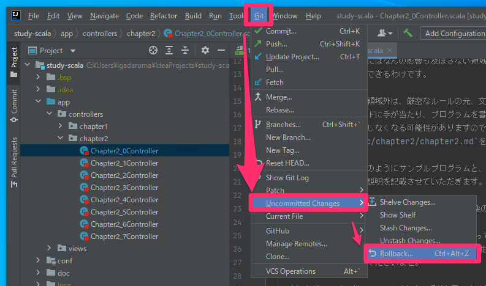

# Chapter3. Scala入門

お待たせしました(?)  
ここからはついに本格的にプログラミングを学んでいきます。  
できるだけ段階的に学習を進められるような、  
サンプルプログラムとその説明を用意してみました。  
学習方法としては、

1. IntelliJで、サンプルプログラム及びコメントを読む。
2. ブラウザで、サンプルプログラムの実行結果を見る。
3. サンプルプログラムをちょびっと触って再度結果を見て変化を感じる。

というのを順に行って欲しいなと思っております。  
3を行ったことでエラーとなりプログラムが壊れてしまうこともあると思います(おっと？)。

安心してください。  
そんな時は後述の`復旧手順`手順で復旧できると思いますので、  
是非怖がらずにチャンレンジしてみていただきたいなと思います！！

## 学習手順

手順1については、先のHTMLファイルを確認いただいたときと同じです。

手順2についてもChapter1で行った作業とほぼ同じになります。  
sbt shellを開き、`run`を実行します。  
※既に実行中ならこの手順は不要です。

ブラウザで開くURLはまとめて後述しますが、  
対応するURLにアクセスすれば以下のように確認できます。

## 復旧手順

ただ、もしかすると、下図のようにエラーが出てしまうケースがあるかもしれません。

その場合は、下図のようにメニューから、  
Git -> Uncommitted Changes -> Rollback を選択して、

・mac

・win

開いた下図モーダルで`Rollback`をした後に、再度ブラウザでURLを開き直してみてください。

それでもうまくいかない場合は、パソコンを再起動して、  
再チャレンジすればうまくいくかもしれません。

## 学習ステップ一覧

以下がソースファイルと各ステップと対応するURLになります。  
長旅になると思います。1日1ステップとかのペースやそれ以下でも構いません。  
じっくり読み進めてみてくださいませ。

|  タイトル   |  ファイル名 | サブタイトル  | 関数名(def) | URL | 
| ---- | ---- | ---- | ---- | ---- |
| 0. コメントとHTML | Chapter2_0Controller  |  -  | chapter2_0 | http://localhost:9000/chapter2/0
| 1. 変数とリテラル  | Chapter2_1Controller |  1-1. 初めての変数(var) | chapter2_1_1 | http://localhost:9000/chapter2/1/1 |
| | |  1-2. 文字列リテラル | chapter2_1_2 | http://localhost:9000/chapter2/1/2 |
| | |  1-3. 変数値の上書き | chapter2_1_3 | http://localhost:9000/chapter2/1/3 |
| | |  1-4. 初めてのval |  chapter2_1_4 | http://localhost:9000/chapter2/1/4 |

以降TODO

* Chapter2_2Controller
  * chapter2_2_1
  * chapter2_2_2
  * chapter2_2_3
  * chapter2_2_4
  * chapter2_2_5
  * chapter2_2_6
  * chapter2_2_7
  * chapter2_2_8
  * chapter2_2_9
  * chapter2_2_10  
* Chapter2_3Controller
  * chapter2_3_1
  * chapter2_3_2
  * chapter2_3_3
  * chapter2_3_4
  * chapter2_3_5
  * chapter2_3_6
  * chapter2_3_7
* Chapter2_4Controller
  * chapter2_4_1
  * chapter2_4_2
  * chapter2_4_3
  * chapter2_4_4
  * chapter2_4_5 
* Chapter2_5Controller
  * chapter2_5_1
  * chapter2_5_2
  * chapter2_5_3
  * chapter2_5_4
  * chapter2_5_5
* Chapter2_6Controller
  * chapter2_6_1
  * chapter2_6_2
  * chapter2_6_3
  * chapter2_6_4
  * chapter2_6_5
  * chapter2_6_6
  * chapter2_6_7
  * chapter2_6_8
  * chapter2_6_9
* Chapter2_7Controller
  * chapter2_7_1
  * chapter2_7_2
  * chapter2_7_3
  * chapter2_7_4
  * chapter2_7_5
  * chapter2_7_6 
