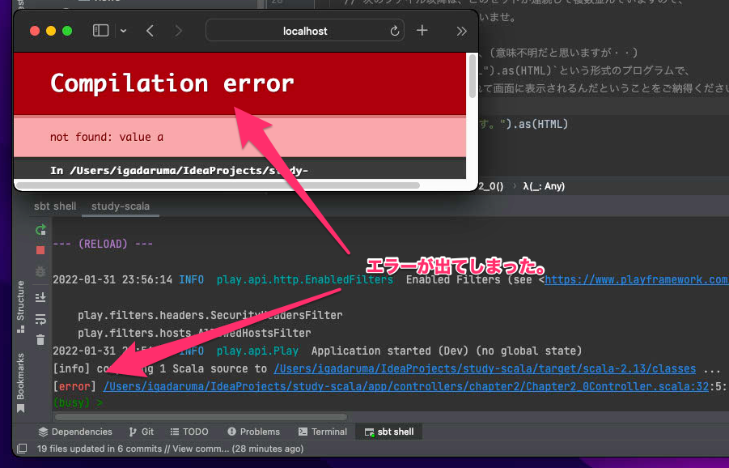

# Chapter3. Scala入門

お待たせしました(?)  
ここからはついに本格的にプログラミングを学んでいきます。  
できるだけ段階的に学習を進められるような、  
サンプルプログラムとその説明を用意してみました。  
学習方法としては、

1. IntelliJで、サンプルプログラム及びコメントを読む。
2. ブラウザで、サンプルプログラムの実行結果を見る。
3. サンプルプログラムをちょびっと触って再度結果を見て変化を感じる。

というのを順に行って欲しいなと思っております。  
3を行ったことでエラーとなりプログラムが壊れてしまうこともあると思います(おっと？)。

安心してください。  
そんな時は後述の`復旧手順`手順で復旧できると思いますので、  
是非怖がらずにチャンレンジしてみていただきたいなと思います！！

## 学習手順

手順1については、先のHTMLファイルを確認いただいたときと同じです。

手順2についてもChapter1で行った作業とほぼ同じになります。  
sbt shellを開き、`run`を実行します。  
※既に実行中ならこの手順は不要です。

ブラウザで開くURLはまとめて後述しますが、  
対応するURLにアクセスすれば以下のように確認できます。

## 復旧手順

ただ、もしかすると、少し書き換えたことにより、  
下図のようにエラーが出てしまうケースがあるかもしれません。

その場合は、下図のようにメニューから、  
Git -> Uncommitted Changes -> Rollback を選択して、

※上図はmacですが、windowsの場合もウィンドウ上部にあるメニューから同様に操作できます。

開いた下図モーダルで`Rollback`をした後に、再度ブラウザでURLを開き直してみてください。

それでもうまくいかない場合は、パソコンを再起動して、  
再チャレンジすればうまくいくかもしれません・・！

## 学習ステップ一覧

以下がソースファイルと各ステップと対応するURLになります。  
ずばり長旅になると思います。1日1ステップとかのペースや、それ以下でも構いません。  
是非じっくり読み進めてみて欲しいです。

|  タイトル   |  ファイル名 | サブタイトル  | 関数名(def) | URL | 
| ---- | ---- | ---- | ---- | ---- |
| 0. コメントとHTML | [Chapter3_0Controller](../../app/controllers/chapter3/Chapter3_0Controller.scala)  |  -  | step0 | http://localhost:9000/chapter3/0
| 1. 変数とリテラル  | [Chapter3_1Controller](../../app/controllers/chapter3/Chapter3_1Controller.scala) |  1-1. 初めての変数(var) | step1_1 | http://localhost:9000/chapter3/1/1 |
| | | 1-2. 文字列リテラル | step1_2 | http://localhost:9000/chapter3/1/2 |
| | | 1-3. 変数値の上書き | step1_3 | http://localhost:9000/chapter3/1/3 |
| | | 1-4. 初めてのval |  step1_4 | http://localhost:9000/chapter3/1/4 |
| 2. 型 | [Chapter3_2Controller](../../app/controllers/chapter3/Chapter3_2Controller.scala) | 2-1. 初めての型 | step2_1 | http://localhost:9000/chapter3/2/1 |
| | | 2-2. 演算子とString型の足し算 | step2_2 | http://localhost:9000/chapter3/2/2 |
| | | 2-3. 初めてのInt(整数)型 | step2_3 | http://localhost:9000/chapter3/2/3 |
| | | 2-4. 初めてのDouble(小数)型 | step2_4 | http://localhost:9000/chapter3/2/4 |
| | | 2-5. Int型とDouble型 | step2_5 | http://localhost:9000/chapter3/2/5 |
| | | 2-6. String型とInt型 | step2_6 | http://localhost:9000/chapter3/2/6 |
| | | 2-7. 文字列リテラルの強化版 | step2_7 | http://localhost:9000/chapter3/2/7 |
| | | 2-8. 基本型いろいろ | step2_8 | http://localhost:9000/chapter3/2/8 |
| | | 2-9. 演算子色々 | step2_9 | http://localhost:9000/chapter3/2/9 |
| | | 2-10. 演算子の計算順序と括弧 | step2_10 | http://localhost:9000/chapter3/2/10 |
| 3. 分岐 | [Chapter3_3Controller](../../app/controllers/chapter3/Chapter3_3Controller.scala) | 3-1. if ~ else if ~ else | step3_1 | http://localhost:9000/chapter3/3/1 |
| | | 3-2. 入れ子のif式 | step3_2 | http://localhost:9000/chapter3/3/2 |
| | | 3-3. match式 | step3_3 | http://localhost:9000/chapter3/3/3 |
| | | 3-4. 分岐と型 | step3_4 | http://localhost:9000/chapter3/3/4 |
| | | 3-5. match式でのガーーーード(if)！ | step3_5 | http://localhost:9000/chapter3/3/5 |
| | | 3-6. 変数の範囲(スコープ) | step3_6 | http://localhost:9000/chapter3/3/6 |
| | | 3-7. ifとmatchの使い分け | step3_7 | http://localhost:9000/chapter3/3/7 |
| 4. 繰り返しとコレクション | [Chapter3_4Controller](../../app/controllers/chapter3/Chapter3_4Controller.scala) | 4-1. List | step4_1 | http://localhost:9000/chapter3/4/1 |
| | | 4-2. 繰り返し処理のためのfor式 | step4_2 | http://localhost:9000/chapter3/4/2 |
| | | 4-3. 繰り返し処理のためのfor式 強化編その1 入れ子 | step4_3 | http://localhost:9000/chapter3/4/3 |
| | | 4-4. 繰り返し処理のためのfor式 強化編その2 条件指定 | step4_4 | http://localhost:9000/chapter3/4/4 |
| | | 4-5. for式サヨナラ!? | step4_5 | http://localhost:9000/chapter3/4/5 |
| 5. 関数 | [Chapter3_5Controller](../../app/controllers/chapter3/Chapter3_5Controller.scala) | 5-1. 関数の無い世界 | step5_1 | http://localhost:9000/chapter3/5/1 |
| | | 5-2. 関数のある世界 | step5_2 | http://localhost:9000/chapter3/5/2 |
| | | 5-3. 関数の引数 | step5_3 | http://localhost:9000/chapter3/5/3 |
| | | 5-4. 関数で複数の値を返したい？タプル型・・あるよ。 | step5_4 | http://localhost:9000/chapter3/5/4 |
| | | 5-5. タプル型・・・だと厳しい？ | step5_5 | http://localhost:9000/chapter3/5/5 |
| 6. クラス | [Chapter3_6Controller](../../app/controllers/chapter3/Chapter3_6Controller.scala) | 6-1. クラスって？ | step6_1 | http://localhost:9000/chapter3/6/1 |
| | | 6-2. フィールド | step6_2 | http://localhost:9000/chapter3/6/2 |
| | | 6-3. メソッド | step6_3 | http://localhost:9000/chapter3/6/3 |
| | | 6-4. メソッド2 | step6_4 | http://localhost:9000/chapter3/6/4 |
| | | 6-5. 組込型の演算子とメソッド | step6_5 | http://localhost:9000/chapter3/6/5 |
| | | 6-6. クラスの継承 | step6_6 | http://localhost:9000/chapter3/6/6 |
| | | 6-7. 抽象クラス | step6_7 | http://localhost:9000/chapter3/6/7 |
| | | 6-8. 型と継承と多態性 | step6_8 | http://localhost:9000/chapter3/6/8 |
| | | 6-9. Any型・Object型 | step6_9 | http://localhost:9000/chapter3/6/9 |
| 7. 組込クラスと高階関数とラムダ式 | [Chapter3_7Controller](../../app/controllers/chapter3/Chapter3_7Controller.scala) | 7-1. Option | step7_1 | http://localhost:9000/chapter3/7/1 |
| | | 7-2. 高階関数 | step7_2 | http://localhost:9000/chapter3/7/2 |
| | | 7-3. ラムダ式の省略記法 | step7_3 | http://localhost:9000/chapter3/7/3 |
| | | 7-4. Option 2 | step7_4 | http://localhost:9000/chapter3/7/4 |
| | | 7-5. List 2 | step7_5 | http://localhost:9000/chapter3/7/5 |
| | | 7-6. Map | step7_6 | http://localhost:9000/chapter3/7/6 |

## まとめ

Scala完全に理解した！

もっとだ！もっと力を！という方は、  
Chapter4の完成をお待ち下さい・・・。  
