# Chapter1. Scalaによるプログラミング👩‍💻入門(Windows版) 

Chapter1では、プログラミングのなんちゃって体験をするの巻です。  
何をやっているかわからないことだらけの内容にはなってしまうと思いますが、  
とりあえず手順をなぞってみて欲しいです。  
実際に体験するのとしないとでは天地の差があるまじろ(?)   
・・・では。いこうぞ😏

## 1. プログラムを書く準備(環境構築)

### 1-1. Chocolatey🍫のインストール

PowerShell(Windowsの組込みソフトウェア)を起動します。  
下図のようにタスクバー左の検索ボックスに`power`といった入力をすると、  
`Windows PowerShell`が表示されると思うので`管理者として実行する`をクリックします。   

※個人パソコンであれば管理者権限が存在すると思いますが、  
なんらかの理由で`管理者として実行する`が行えない場合は、パソコンの所有者(？)に相談ください・・。


以下のような確認のダイアログが出た場合は`はい`を選択します。


PowerShellで以下のコマンドを実行します。

```
Set-ExecutionPolicy Bypass -Scope Process -Force; [System.Net.ServicePointManager]::SecurityProtocol = [System.Net.ServicePointManager]::SecurityProtocol -bor 3072; iex ((New-Object System.Net.WebClient).DownloadString('https://community.chocolatey.org/install.ps1'))
```

上記をコピーして(上記エリア内にカーソルを合わせると右端に出てくるアイコンをクリックすると簡単です)、  
PowerShell上で貼り付けます(PowerShellウィンドウ上を右クリックで張り付きます)。  
以下のような感じになれば、Enterキーで確定します。


暫く待つと以下のような感じに表示されると思います。グレートです🍫


### 1-2. JDK, sbt, IntelliJのインストール

引き続きPowerShellで以下のコマンドを実行します。

```
choco install -y adoptopenjdk8 sbt intellijidea-community
```


暫く(通信速度等によっては数分〜数十分ほどかかるかもしれません)すると、  
最終的に以下のように表示されて完了すると思います。  
※実行タイミングによって、微妙に数字等の表記は異なると思いますが基本的には問題なしです。


ここで、インストールしたものたちの解説をしておきます。

* JDK(adoptopenjdk8): Scalaのエンジン
* sbt: Scalaの親友
* IntelliJ(intellijidea-community): プログラマの心の友

・・・冗談です。  
ただ、使いながら解説したほうが良いと思ってますので、    
今後のチャプター等で逐次説明を交えていきます。

### 1-3. IntelliJを起動してScalaプラグインを追加

※以降の手順・画像はIntelliJのバージョンによって多少異なる場合があります。

デスクトップにIntelliJのショートカットアイコンが増えていると思います。  
ダブルクリックして起動します。


利用規約が表示されるので、チェックを入れて進みます。


匿名データとしてあなたの使用情報を集めてよい？みたいな事を聞かれるので、  
これはどちらでもいいですが、悩めば`Dont't Send`を選択しておけばいいと思います。

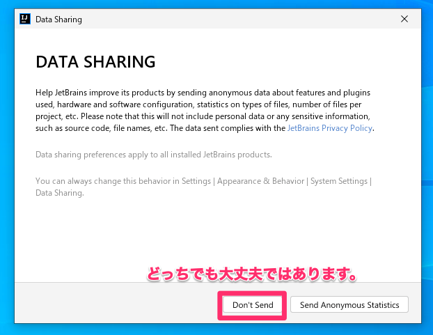

次にScalaのプラグイン(追加機能みたいな感じ)を下図のように追加します。  
※下図"③"は必要に応じて入力ください。


IntelliJの再起動が必要なので、以下のように操作します。


## 2. サンプルプログラムの起動

### 2-1. IntelliJからGit経由で取得

サンプルScalaプログラムをダウンロードしていきます。  
`Get from VCS`を選択します。

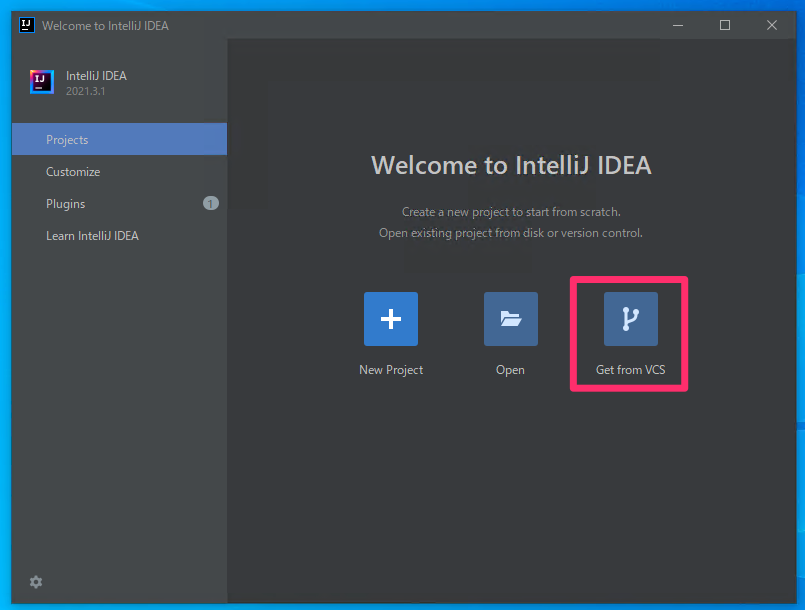

(※場合によっては以下にあるかもしれません。)

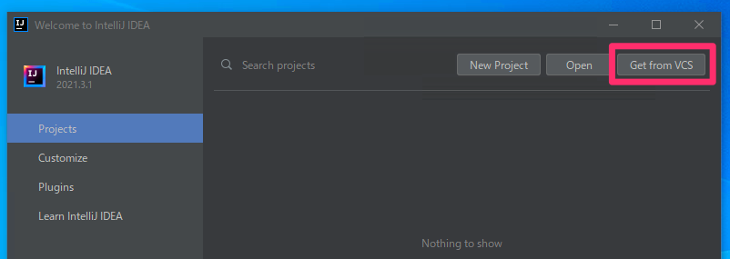

(※さらに、もしメニューバーが表示されている状況ならば以下にあります。)

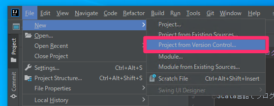

開いたウィンドウの`URL`に以下のURLを入力します。  
※これはダウンロードするプログラム(ソース)がおいてある場所です。

```
https://github.com/igadaruma/study-scala
```

その下の`Directory`はダウンロードしたプログラム(ソース)を保存する先です。  
お好きな場所を指定ください。悩むようなら元々入っている値のままでOKです。

そして、`Git`というツールをインストールする必要がありますので、  
`Donwload and Install`をクリックします(表示されていなければスルーでOKです)。

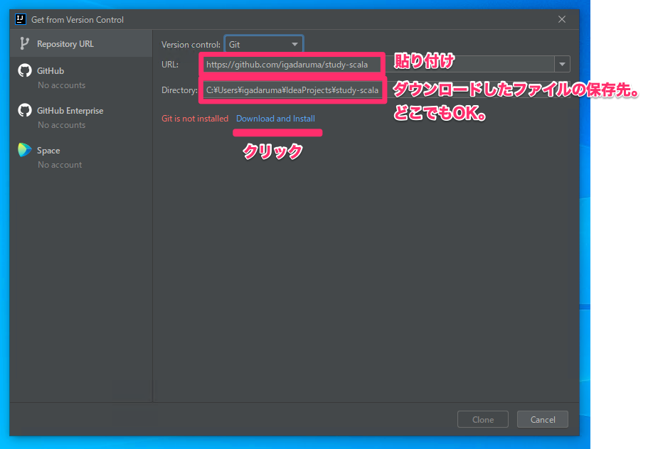

以下が表示されたら`はい`を。

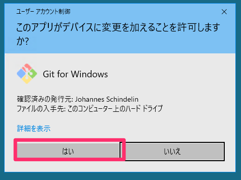

完了すれば`Clone`(ダウンロード的な処理)します。

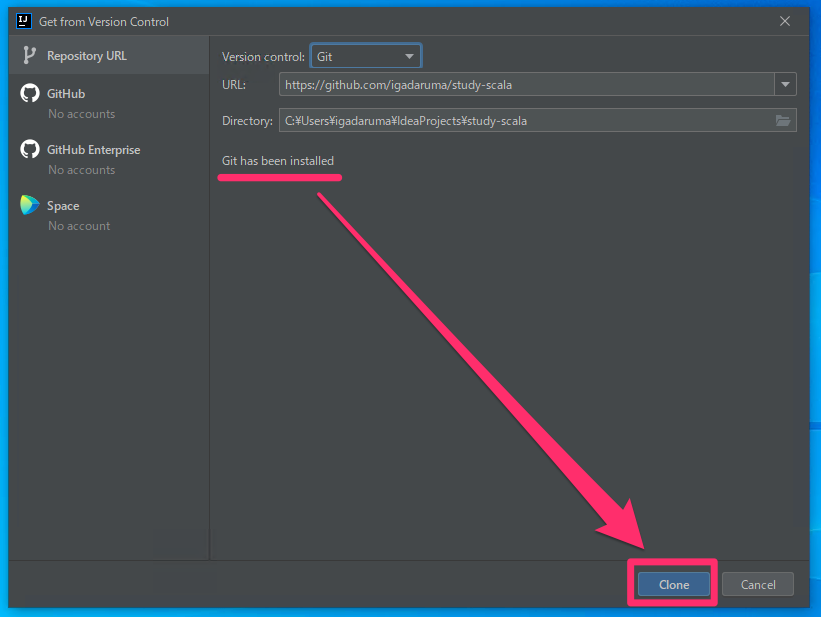

もし以下が表示されたら`Trust Project`を選択します。

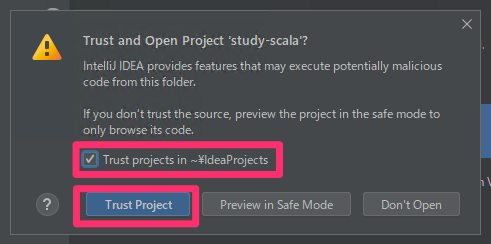

もし以下が表示されたら`アクセスを許可する`を選択します。

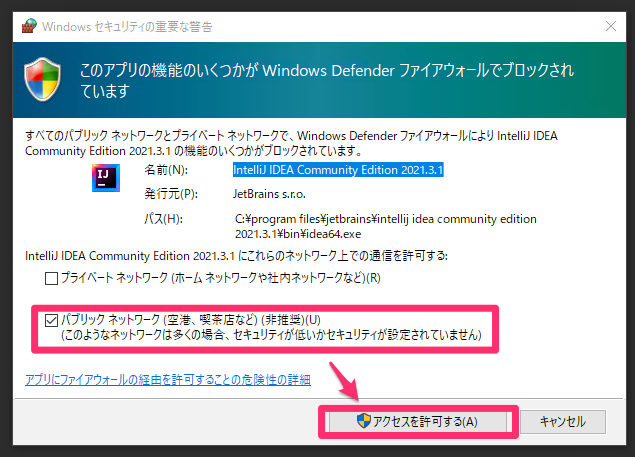

もし以下のようなアドバイスモーダルが表示されたら`Close`を選択します。

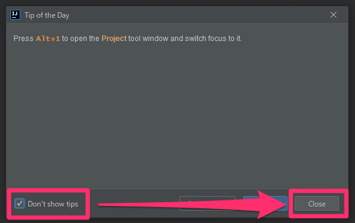

初めて開く時はIntelliJが色々セットアップしてくれるので、  
落ち着くのを待ちます。状況次第ですが数分〜数十分かかる場合があります。

※下図で表示されている"Scalaっと"から始まる文章は書きかけ内容になっているので、  
実際は別の内容が表示されていると思います。

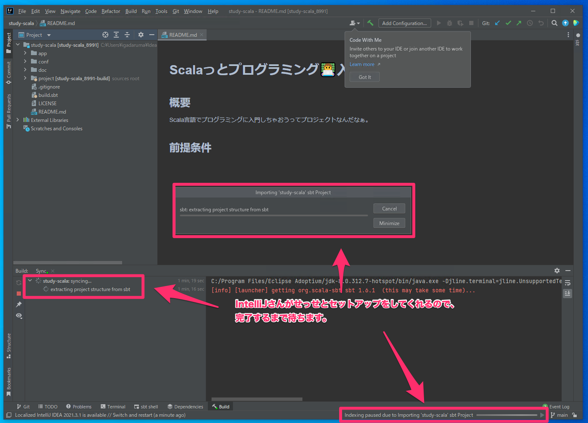

以下が落ち着いた状態です。

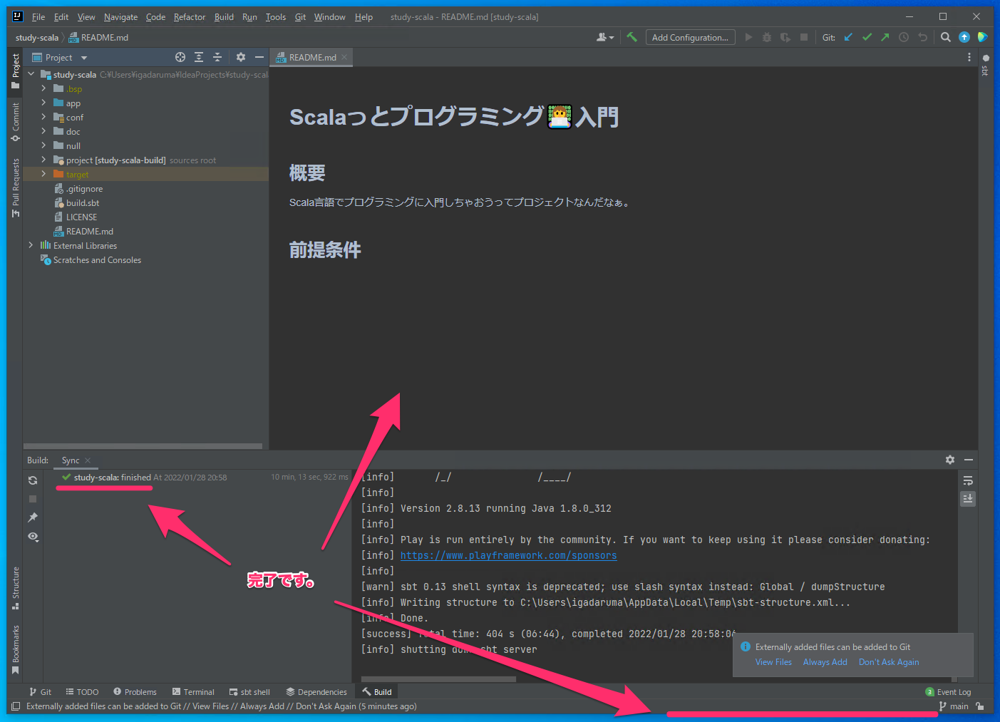

### 2-2. IntelliJのsbt shellからプログラムを起動

ウィンドウの下の方にある`sbt shell`をクリックすると、  
ウィンドウ下部の表示が切り変わり、暫く文字がわらわらと出ます。  
暫く(初回は数分かかるかもしれません)待って、以下のような表示になれば文字入力ができるので、  
`run`と入力してEnterキーを押します。

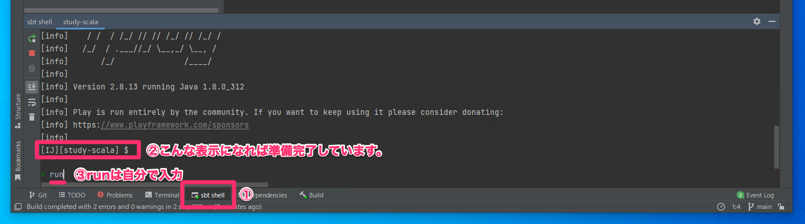

さらにまた暫く待つと以下のような始まった感のあるメッセージが出れば起動完了です。

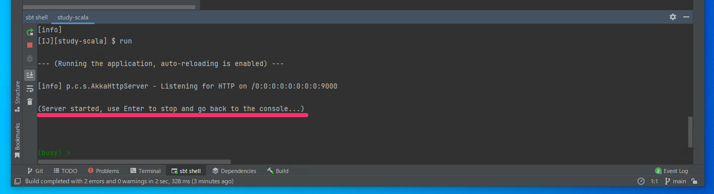

途中、もし以下が表示されたら`アクセスを許可する`を選択します。

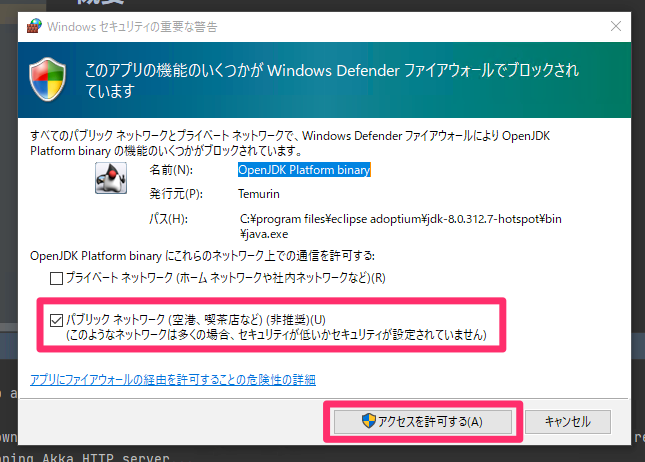

そのままIntelliJは放置し、以下のリンクをクリックします。  
起動したプログラムにアクセスすることができます。  
👉 [http://localhost:9000](http://localhost:9000)  
初回アクセス時はちょっと(3分以内だとは思います)時間がかかるので焦らず待ちます。  
(ちなみに`localhost`というのは`自分のパソコン`みたいな意味です。)

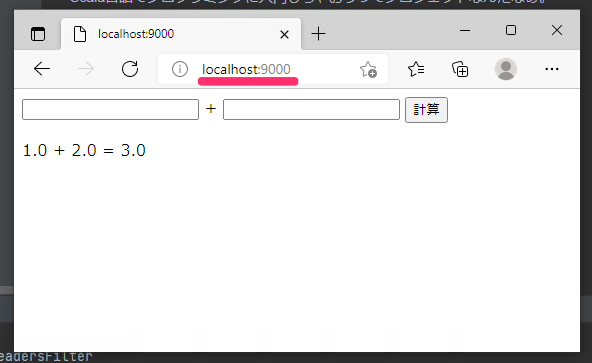

では使ってみましょう。  
両方のテキストボックスに以下のように好きな数字を入れて`計算`をクリックします。

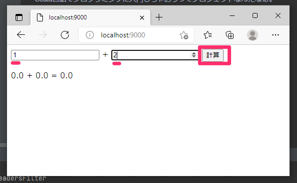

入力された数字が計算されていることが確認できれば成功です！

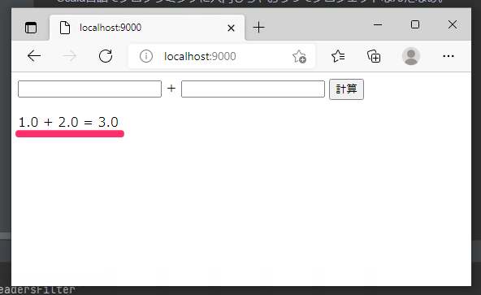

## 3. はじめてのプログラミング

ついにプログラマーになる瞬間がやってきました!  
プログラムを書き換えるというのを体験していきます。

### 3-1. 引き算に変えてみる

足し算プログラムだったのを引き算プログラムに変えてみましょう。

`app/controllers/SampleController.scala`の30行目付近の以下を修正します(後に画像があります)。

```
// 足し算しています。
val answer = leftAsNumber + rightAsNumber
```

ここに以下の修正を行います。

* `足し` → `引き`
* `+` → `-`

結果的にはこんな感じに変わります。

```
// 引き算しています。
val answer = leftAsNumber - rightAsNumber
```

手順を画像で見るとこんな感じ。

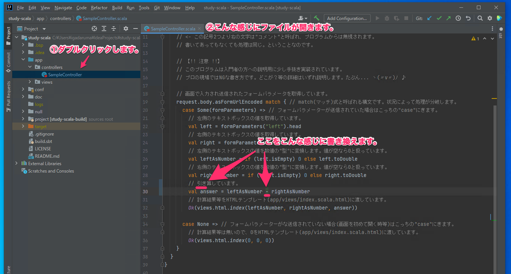

次に`my-first-play/app/views/index.scala.html`の15行目を修正します(後に画像があります)。

```
<input type="number" name="left"/> + <input type="number" name="right"/>
```

* `+` → `-`

```
<input type="number" name="left"/> - <input type="number" name="right"/>
```

同様に19行目を修正します。

```
@left + @right = @answer
```

* `+` → `-`

```
@left - @right = @answer
```

画像で見るとこんな感じ。

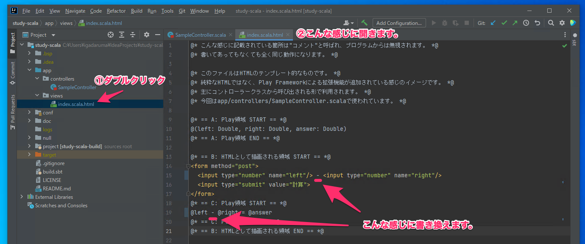

### 3-2. 動作確認

今一度以下にアクセスしてみましょう。  
👉 [http://localhost:9000](http://localhost:9000)

画面が微妙に変わっていると思うので、  
先程と同様に操作するとこんな感じ。引き算になりました。

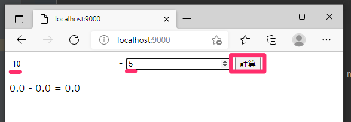

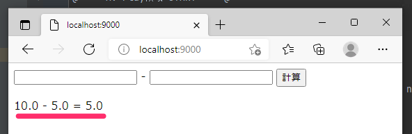

## まとめ

プログラミング完全に理解した！  
プログラミング完全に理解した！

完全に理解したけど物足りないという方は、   
[Topページ](https://github.com/igadaruma/study-scala) に戻りChapter2に進行を。

## 参考文献

### 利用したソフトウェアの公式ページ集

* [Chocolatey公式(英語)](https://chocolatey.org/)
* [Git公式(英語)](https://git-scm.com/)
* [Adoptium(JDK)公式(英語)](https://adoptium.net/)
* [sbt公式(英語)](https://www.scala-sbt.org/)
* [JetBrains公式(IntelliJ開発元)](https://www.jetbrains.com/ja-jp/)
