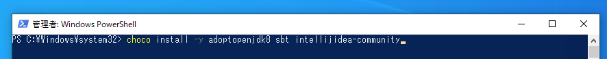
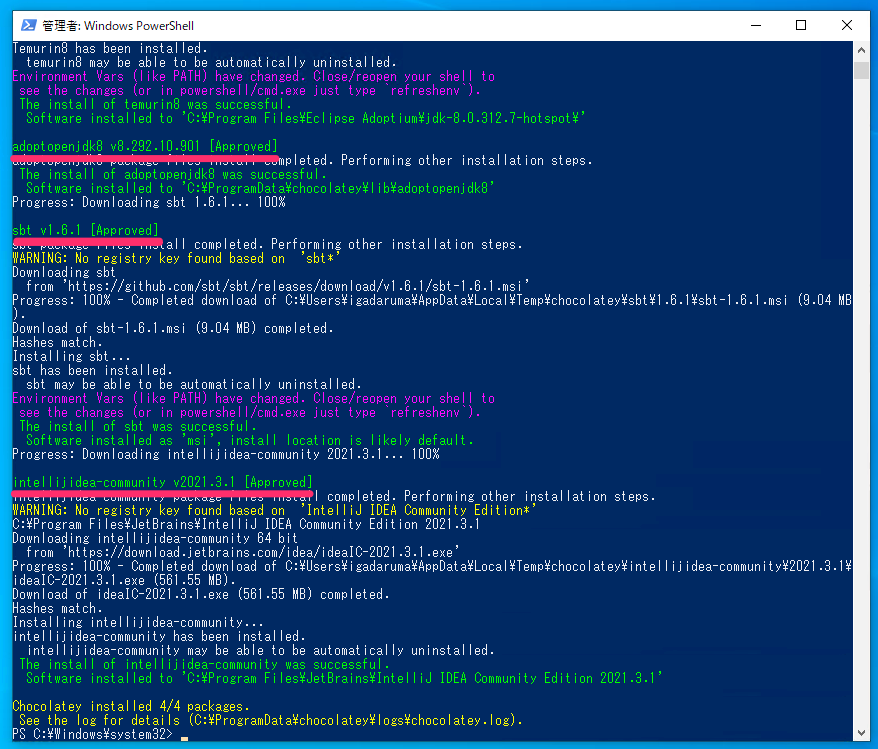

# Scalaによるプログラミング👩‍💻入門(Windows版)

## 環境構築(プログラムを書く準備)

### 1. Chocolatey🍫のインストール

PowerShell(Windowsの組込みソフトウェア)を起動します。  
下図のようにタスクバー左の検索ボックスに`power`といった入力をすると、  
`Windows PowerShell`が表示されると思うので`管理者として実行する`をクリックします。   

※個人パソコンであれば管理者権限が存在すると思いますが、  
なんらかの理由で`管理者として実行する`が行えない場合は、パソコンの所有者(？)に相談ください・・。


以下のような確認のダイアログが出た場合は`はい`を選択します。


PowerShellで以下のコマンドを実行します。

```
Set-ExecutionPolicy Bypass -Scope Process -Force; [System.Net.ServicePointManager]::SecurityProtocol = [System.Net.ServicePointManager]::SecurityProtocol -bor 3072; iex ((New-Object System.Net.WebClient).DownloadString('https://community.chocolatey.org/install.ps1'))
```

上記をコピーして(上記エリア内にカーソルを合わせると右端に出てくるアイコンをクリックすると簡単です)、  
PowerShell上で貼り付けます(PowerShellウィンドウ上で右クリックすると張り付きます)。  
以下のような感じになれば、Enterキーで確定します。


暫く待つと以下のような感じに表示されると思います。グレートです。


### 2. Git, JDK, sbt, IntelliJのインストール

引き続きPowerShellで以下のコマンドを実行します。

```
choco install -y git adoptopenjdk8 sbt intellijidea-community
```



暫く(通信速度等によっては数分〜数十分ほどかかるかもしれません)すると、  
最終的に以下のように表示されて完了すると思います。  
※実行タイミングによって、微妙に数字等の表記は異なると思いますが基本的には問題なしです。



後乗せですが、インストールしたものたちの解説をしておきます。

* Git: プログラマの親友
* JDK: Scalaのエンジン
* sbt: Scalaの親友
* IntelliJ: プログラマの心の友

・・・冗談です。  
ただ、使いながら解説したほうが良いと思ってますので、    
逐次説明を交えていきます。

### 3. IntelliJを起動してScalaプラグインを追加

※以降の手順はIntelliJのバージョンによって多少異なる場合があります。

デスクトップにIntelliJのショートカットアイコンが増えていると思います。  
ダブルクリックして起動します。


匿名データとしてあなたの使用情報を集めてよい？みたいな事を聞かれるので、  
これはどちらでもいいですが、悩めば`Dont't Send`を選択しておけばいいと思います。


次にScalaのプラグイン(追加機能みたいな感じ)を下図のように追加します。  
※下図"③"は必要に応じて入力ください。


IntelliJの再起動が必要うなので、以下のように操作します。


## サンプルプログラムの確認

### 1. IntelliJからGit経由で取得

以下のURLから取得します。詳しくは動画🎥にて。

```
https://github.com/igadaruma/my-first-play
```

### 2. IntelliJのsbt shellから起動

以下のコマンドを実行します。詳しくは動画🎥にて。

```
run
```

起動後は以下のURLにアクセスして動作を確認できます。  
👉 [http://localhost:9000](http://localhost:9000)

## はじめてのプログラミング

### 1. 引き算に変えてみる。

`app/controllers/SampleController.scala`の30行目付近の以下を修正します。

```
// 足し算しています。
val answer = leftAsNumber + rightAsNumber
```

以下にしてみましょう。

* `足し` → `引き`
* `+` → `-`
    

```
// 引き算しています。
val answer = leftAsNumber - rightAsNumber
```

👉 [http://localhost:9000](http://localhost:9000)

### 2. 画面も調整してみる。

`my-first-play/app/views/index.scala.html`の15行目を修正します。

```
<input type="number" name="left"/> + <input type="number" name="right"/>
```

* `+` → `-`

```
<input type="number" name="left"/> - <input type="number" name="right"/>
```

同様に19行目を修正します。

```
@left + @right = @answer
```

* `+` → `-`

```
@left - @right = @answer
```

👉 [http://localhost:9000](http://localhost:9000)

## まとめ

プログラミング完全に理解した！

## 参考文献

### 利用したソフトウェアの公式ページ集

* [Chocolatey公式(英語)](https://chocolatey.org/)
* [Git公式(英語)](https://git-scm.com/)
* [Adoptium(JDK)公式(英語)](https://adoptium.net/)
* [sbt公式(英語)](https://www.scala-sbt.org/)
* [JetBrains公式(IntelliJ開発元)](https://www.jetbrains.com/ja-jp/)
